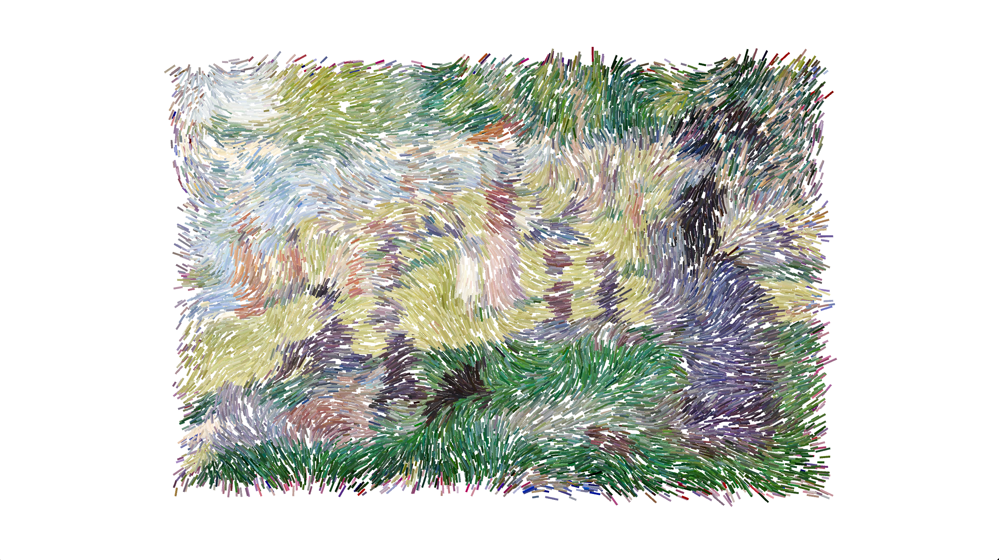

# Sunday-in-the-Park-with-George

“Sunday in the Park with George” is a textural, three dimensional experience of Georges Seurat's two-dimensional "A Sunday Afternoon on the Island of La Grande Jatte." Using Processing 3, this particle system comments on the narrative of George Seurat’s pointillism and how people considered his paintings to be failures because they didn't have any "life" or "depth," when in truth, his methodology and subject matter, in his eyes, were quite lively.  

Downloading [Processing](https://processing.org/) is necessary to run this project.
